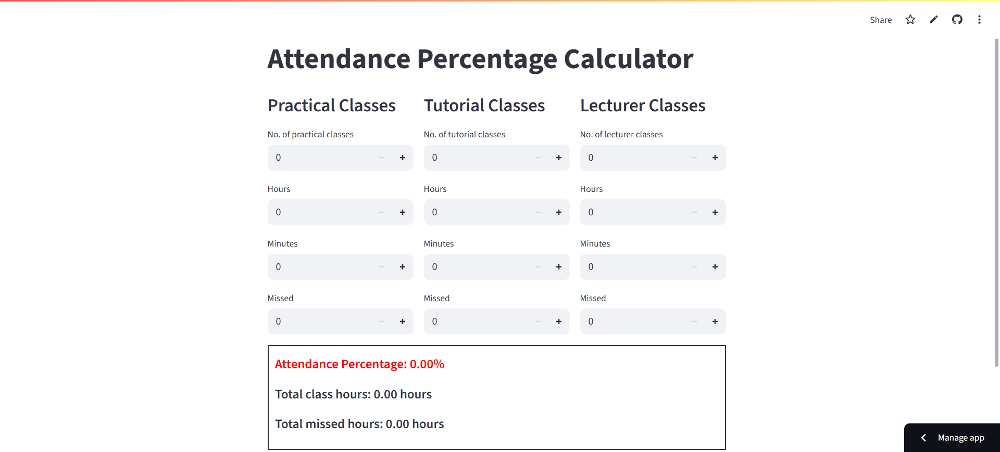

# 🎓 Attendance Percentage Calculator

This is a simple and interactive web app built with [Streamlit](https://streamlit.io/) that allows students or educators to calculate attendance percentages based on missed and attended class hours for **Practical**, **Tutorial**, and **Lecture** sessions.

🖥️ **Live Demo**:  
[https://fisheatrice-attendance-percentage-calculator-main-7n21ae.streamlit.app/](https://fisheatrice-attendance-percentage-calculator-main-7n21ae.streamlit.app/)

## 📸 Screenshot



---

## ✨ Features

- Enter the number of classes for each type (Practical, Tutorial, Lecturer).
- Specify class duration in **hours and minutes**.
- Enter the number of **missed classes**.
- Automatically calculates:
  - **Total class hours**
  - **Total missed hours**
  - **Attendance percentage**
- Conditional color indicators (green if ≥ 80%, red if < 80%).

---

## 🚀 Getting Started (Local Setup)

You can run the app locally using Python and Streamlit.

### 1. Clone the Repository

```bash

git clone https://github.com/FishEatRice/Attendance_Percentage_Calculator.git
cd Attendance_Percentage_Calculator
